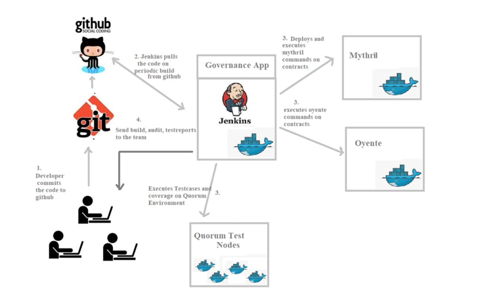

# README
**Introduction**

This document is intended to provide an understanding of Jenkins Continuous integration and Continuous Deployment (CI/CD) mechanism of Ledgerium development project.

**High Level Architecture**

Below is the Jenkins workflow.



In the above diagram, Jenkins,mythril,oyente are dockers containers.

Jenkins from docker needs to communicate with other dockers present in same hierarchy. “Docker in Docker” configuration is done for communication to other docker machines.

Mythril, oyente and quorum test nodes are dockers. Jenkins communicates with other dockers and execute commands. The generated reports are forwarded to team.

Mocha tests are executed on Quorum developer setup of governance app from Jenkins and provide reports to the team.
Please refer to below link for configuring “Docker in Docker”.

```https://getintodevops.com/blog/the-simple-way-to-run-docker-in-docker-for-ci```

Notes: Docker commands in the shell file expects the code snippet path of host file because of docker-in-docker configuration. The **docker-compose.yaml** genesis path is modified with host genesis paths and placed in **Jenkins home > workspace > {PROJECT}**. If there are any modifications in **docker-compose.yaml**, please make it dynamic or make sure this is changed in host machine.

Note: The **genesis.json** and **docker-compose.yml** files are present in **~/jenkinshome/workspace** under host machine. If there any changes to **docker-compose.yml** . please have a look at **docker-compose.yml** genesis path in the file located in  **~/jenkinshome/workspace** and replace the file with hostmachine genesis paths.

**Steps to Setup CI/CD**

Install docker and docker-compose in hostmachine. 

**Docker installation:**

```curl -fsSL https://download.docker.com/linux/ubuntu/gpg | sudo apt-key add –
sudo add-apt-repository "deb [arch=amd64] https://download.docker.com/linux/ubuntu $(lsb_release -cs) stable"
sudo apt-get update
apt-cache policy docker-ce
sudo apt-get install -y docker-ce
sudo systemctl status docker
Reference: https://www.digitalocean.com/community/tutorials/how-to-install-and-use-docker-on-ubuntu-16-04
```

**Docker compose installation:**

```
sudo curl -L https://github.com/docker/compose/releases/download/1.23.2/docker-compose-`uname -s`-`uname -m` -o /usr/local/bin/docker-compose
sudo chmod +x /usr/local/bin/docker-compose
docker-compose –version
```

Reference: 

```
https://www.digitalocean.com/community/tutorials/how-to-install-docker-compose-on-ubuntu-16-04
```

**Run and Setup Jenkins docker**

```
docker run -d --name ledgeriumjenkins -p 8080:8080 -p 50000:50000 -v /var/run/docker.sock:/var/run/docker.sock -v ~/jenkinshome:/var/jenkins_home jenkins/jenkins:lts
```

After running above command, set up docker in docker configuration as shown below for executing other dockers(mythril and oyente)

Login into jenkins docker machine and setup docker in docker configuration following below link. 

https://getintodevops.com/blog/the-simple-way-to-run-docker-in-docker-for-ci

Following link will be used for setting up node and emails configurations for Jenkins

http://125.254.27.14:28080

Setup admin password(password can be viewed in docker logs) and users can be created in Jenkins. Mythril (**mythril/myth docker image**) and oyente (**qspprotocol/oyente-0.4.24 docker image**) dockers are used for security auditing which are configured in jenkin jobs. This scripts trigger docker commands of security audit tools and governance app tools.

Scripts are available at

https://github.com/ledgerium/ledgeriumcicd

**contract_audit_mythril**

This script is used to run each contract file e.g. AdminSetValidator.sol and SimpleSetValidator.sol against the Mythril which is an open source Ethereum smart contract and dApp (decentralized app) security analysis tool. It sends the email with the link of the static report, available on Jenkins system to dev@ledgerium.net

**contract_audit_oyente**

This script is used to run each contract file e.g. AdminSetValidator.sol and SimpleSetValidator.sol against the Oyente which is another open source static smart contract security analysis tool. It sends the email with the link of the static report, available on Jenkins system to dev@ledgerium.net

**contract_testreport**

This script is used to run mocha tests on AdminSetValidator.sol and SimpleSetValidator.sol. Also, it will have integration with solidity doc-gen package.


**Reference:**

https://medium.com/@gustavo.guss/quick-tutorial-of-jenkins-b99d5f5889f2
